# RayTracer
A ray tracing program

Mainly based on 'Ray Tracing' books from Peter Shirley: http://in1weekend.blogspot.com/2016/01/ray-tracing-in-one-weekend.html
I skipped the boring (for me) texture generation part and also the motion bluring, I preffered to go further enhancing the materials and loading obj files.

But not only, info coming soon on the Computational Physics Blog: https://compphys.go.ro

Some papers that were used:

'An Anisotropic Phong BRDF Model' by Michael Ashikhmin and Peter Shirley
https://www.cs.utah.edu/~shirley/papers/jgtbrdf.pdf

Osada et All, 'Shape Distributions'
http://www.cs.princeton.edu/~funk/tog02.pdf

'Fast, minimum storage ray-triangle intersection'
Tomas Möller and Ben Trumbore. 
Journal of Graphics Tools, 2(1):21--28, 1997. 
http://www.graphics.cornell.edu/pubs/1997/MT97.pdf

The project has some known issues, for example loading an object from an obj file does not split correctly concave polygons, they must be convex.
Also importance sampling with composite objects has some issues. I know why they occur and how it could be solved, but I don't have enough patience for those changes right now :)

Some images obtained while implementing it:

After the first book, 'Ray Tracing in one weekend':

With local illumination, depth of field and textures:

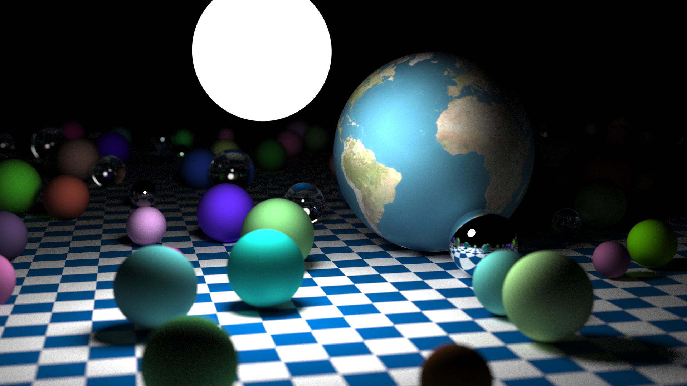

The Cornell box (during the 'next week' book):

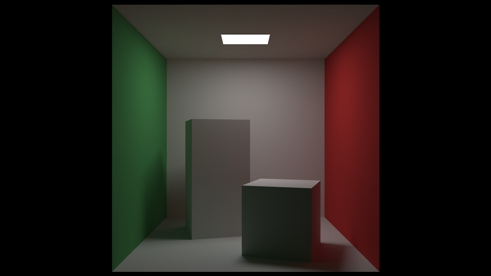

Adding triangles, already beyond the 'rest of your life' book:

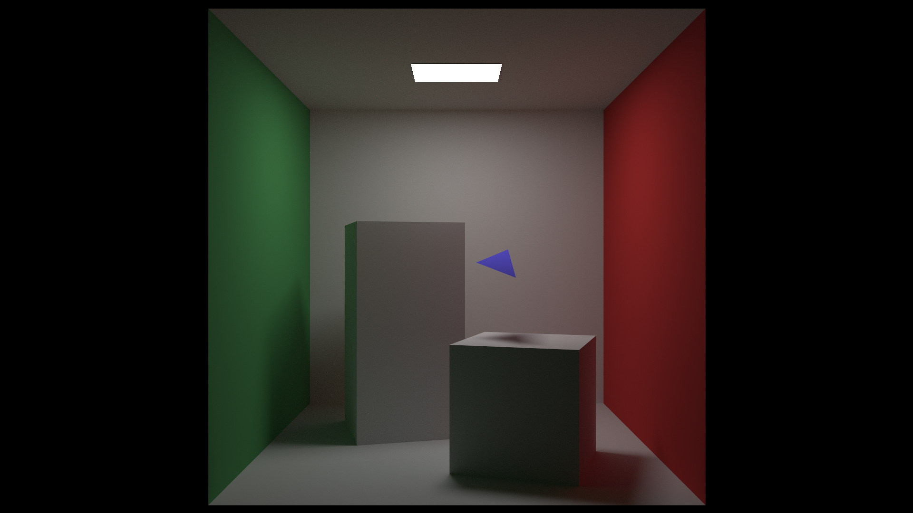

Adding Beer-Lambert law for transparent objects:

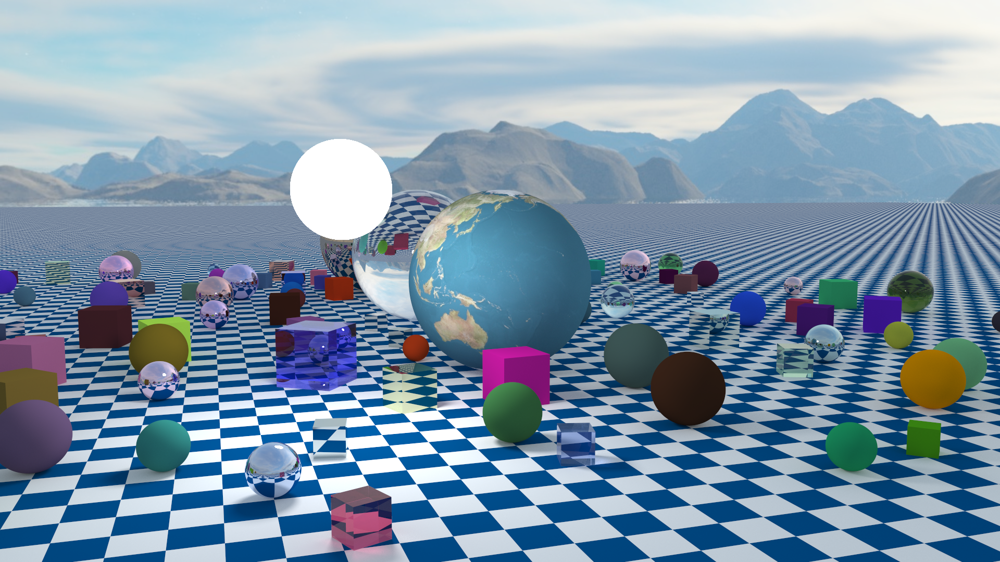

The first obj file loaded in the Cornell box:

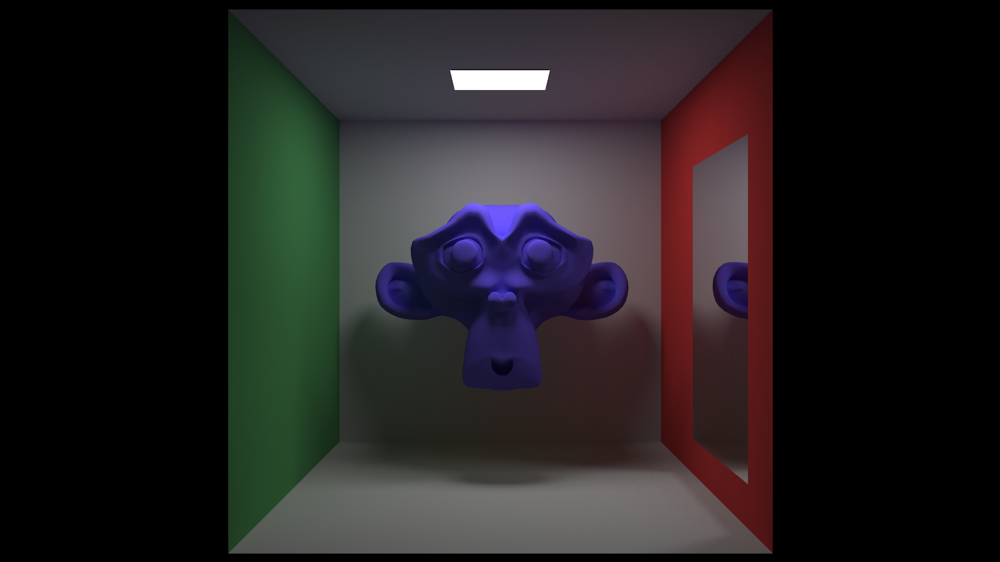

Making it transparent:

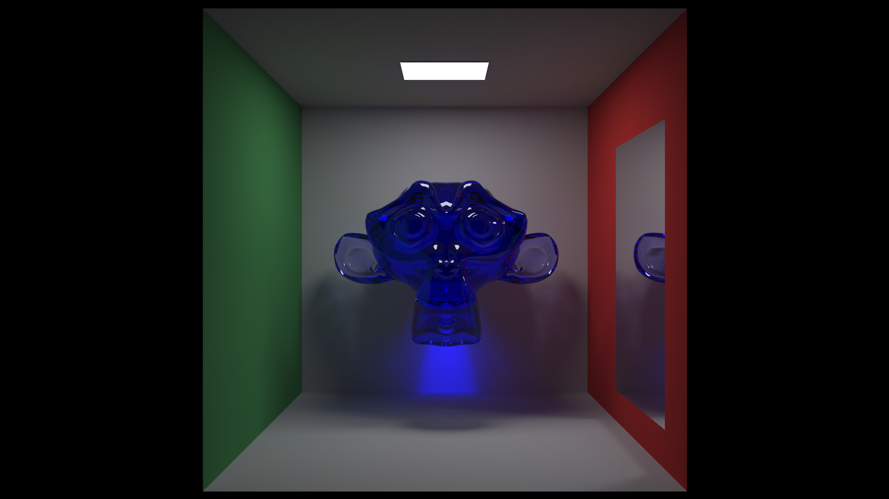

Trying some other obj models:

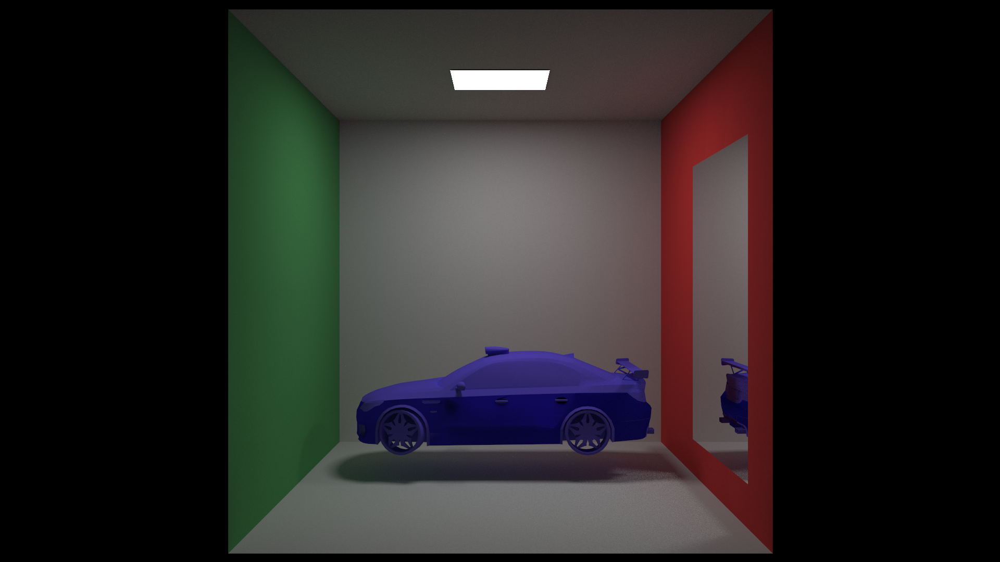

Now together with colors/textures:

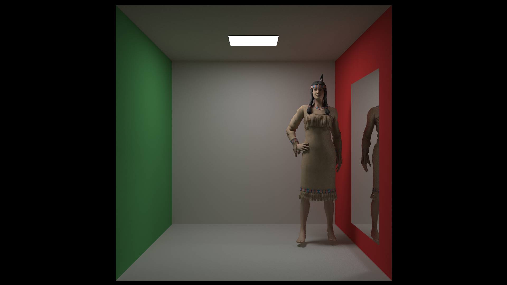

Implementing specular reflection:

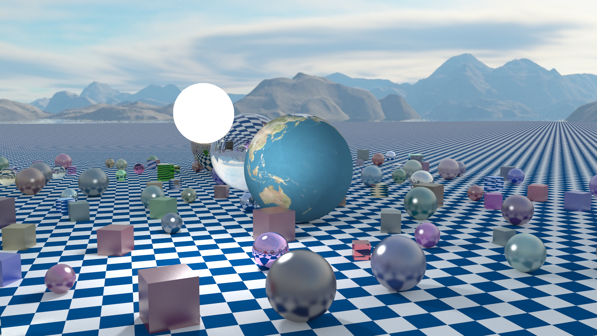

Trying it on a model, exponents are too high:

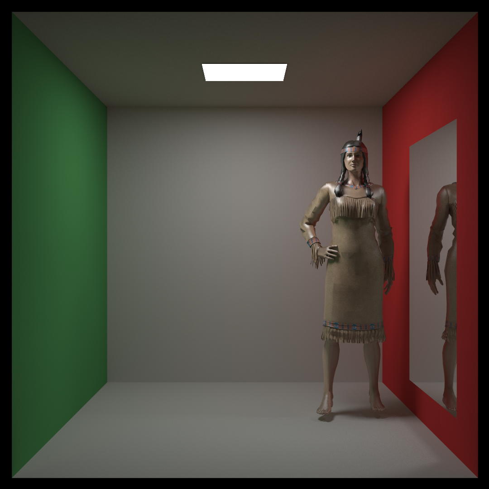

More testing:

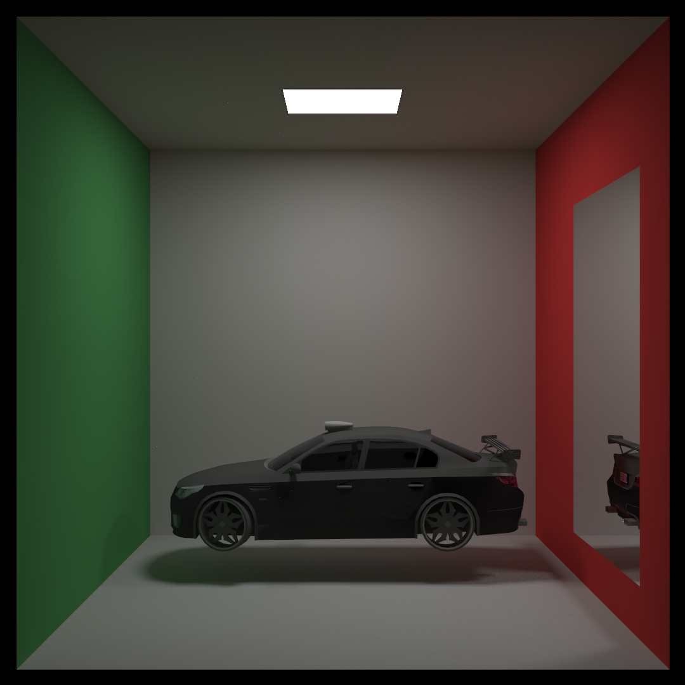

And some new model for testing the features:

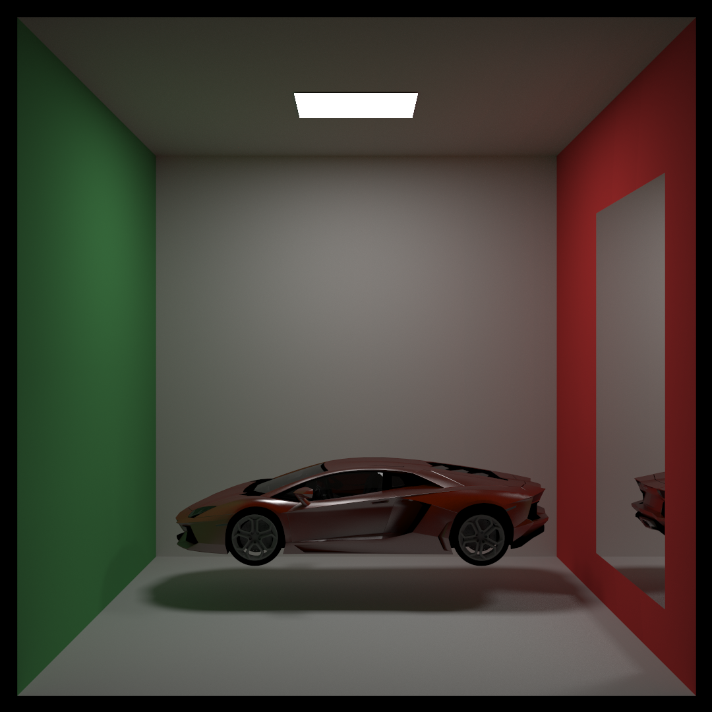
